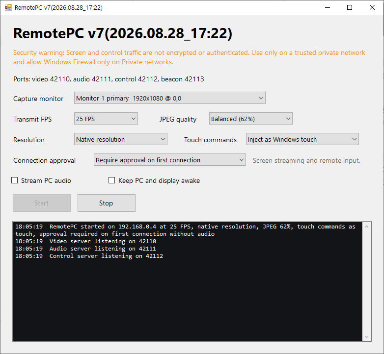

# RemotePC for Meta Quest

RemotePC streams your Windows PC screen to Meta Quest and sends remote input back to the PC.

## Downloads

### Windows PC

- [Download the latest RemotePC.exe](https://github.com/codebox77/RemotePC-Windows-for-Meta-Quest-Mirror-Android-Phone-Control/releases/latest/download/RemotePC.exe)
- [Open the latest GitHub release](https://github.com/codebox77/RemotePC-Windows-for-Meta-Quest-Mirror-Android-Phone-Control/releases/latest)

Download `RemotePC.exe` and run it on your Windows PC.

### Meta Quest

[Install RemotePC from the Meta Quest Store](https://www.meta.com/experiences/quest/886009210932925/)

## Quick Start

1. Connect your Windows PC and Meta Quest to the same trusted private network.
2. Run `RemotePC.exe` on the PC.
3. Select the monitor, frame rate, JPEG quality, resolution, and input options.
4. If Windows Firewall prompts you, allow access on **Private networks only**.
5. Start the server in the PC app.
6. Launch RemotePC on Meta Quest and connect to the PC.
7. Approve the request on the PC if first-connection approval is enabled.

## Security Warning

RemotePC screen and control traffic is not encrypted or authenticated.

- Use RemotePC only on a trusted home or office private network.
- Do not use it on public Wi-Fi.
- Do not expose the RemotePC ports to the internet or configure port forwarding for them.
- Allow Windows Firewall access on private networks only.

